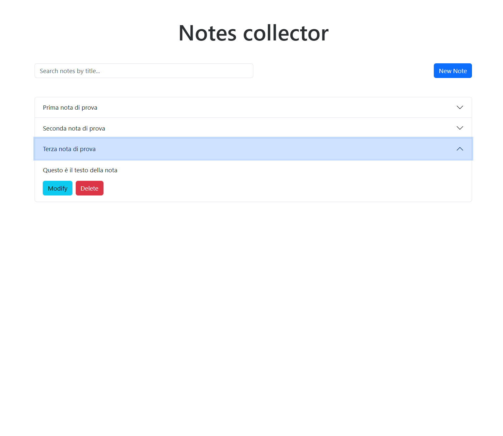
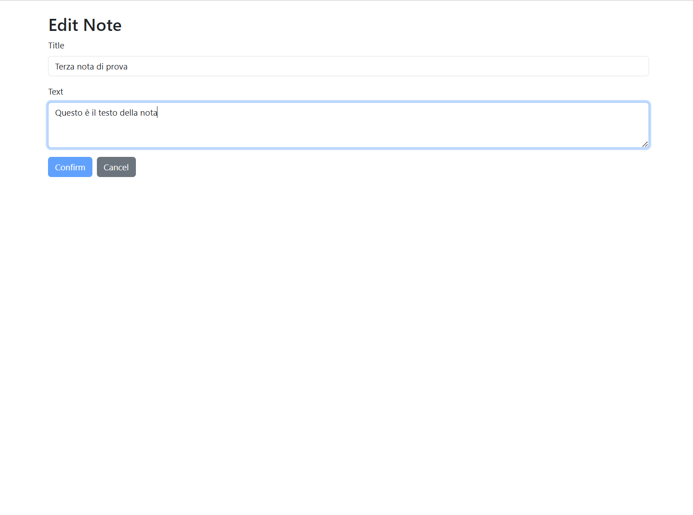

# README - Notes Management Webapp

This is a webapp to create, view, and manage notes. The backend is built with **Spring Boot**, and the frontend with **Angular**. Notes are stored in a **PostgreSQL** database, and the app is containerized using **Docker**.

---

## Running the App

1. **Clone the repository**:  
  Clone the repository with:
   ```bash
   git clone <repository-url>
   ```

  Then run:
  ```bash
   docker-compose up --build
  ```
   

## Technologies Used

- **Backend**: Spring Boot (Java 21), PostgreSQL 17  
- **Frontend**: Angular 18, Bootstrap v5.2  
- **Containerization**: Docker & Docker Compose  & Nginx

---

## APIs

### Endpoints and Parameters

1. **Add a Note**: `POST /api/v1/notes`  
   - Parameters: `title` (String), `text` (String)

2. **Get All Notes**: `GET /api/v1/notes`  

3. **Get a Single Note**: `GET /api/v1/notes/{id}`  
   - Parameters: `id` (Long)

4. **Update a Note**: `PUT /api/v1/notes/{id}`  
   - Parameters: `id` (Long), `title` (String), `text` (String)

5. **Delete a Note**: `DELETE /api/v1/notes/{id}`  
   - Parameters: `id` (Long)

### Response Codes

| Code | Description              |
|------|--------------------------|
| 200  | OK                       |
| 201  | Created                  |
| 204  | No Content               |
| 400  | Bad Request              |
| 404  | Not Found                |

---

## Frontend

The app provides two main paths:

1. **`/` (Home)**:  
   - View a list of notes and filter them.  


   - Open a **modal** to create a new note.  


2. **`/edit/:id` (Edit Note)**:  
   - Modify and update an existing note.  


---